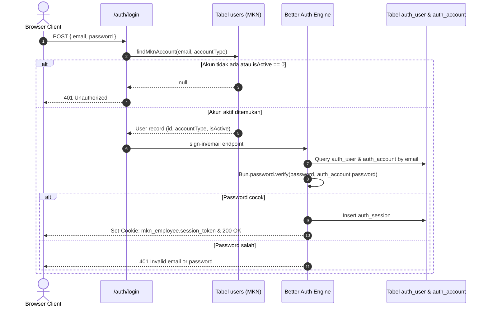

# Tinjauan Teknis Provisioning Pengguna, Kredensial Legacy, Migrasi, dan Transaksi (Tiket U03)

Dokumen ini memuat keputusan arsitektur, analisis integritas data, dan strategi transaksional sebelum implementasi mutasi pembuatan pengguna (`POST /admin/users` - Tiket U04) serta pembaruan profil pengguna (`PATCH /admin/users/:id` - Tiket U05).

---

## 1. Latar Belakang dan Masalah

Aplikasi *MKN Site* memiliki arsitektur *dual-identity* yang menggabungkan:
1. **Model Pengguna Internal MKN** (tabel `users`, `roles`, `permissions`, `user_roles`, `audit_logs`):
   - Mengelola tipe akun (`account_type`: `employee` vs `admin`), status keaktifan (`is_active`), relasi RBAC, dan audit log.
   - Menggunakan ID integer autoincrement.
2. **Model Sesi & Kredensial Better Auth** (tabel `auth_user`, `auth_account`, `auth_session`, `auth_verification`):
   - Mengelola sesi opaque browser, verifikasi password via plugin credential, dan cookie HTTP-only (`mkn_employee` & `mkn_admin`).
   - Menggunakan ID string UUID.

### Risiko Tanpa Transaksi Terpadu:
- **Orphaned Identity**: Jika pembuatan `auth_user` berhasil tetapi `users` gagal (atau sebaliknya), sistem akan memiliki data "setengah jadi" yang menyebabkan error saat login atau inkonsistensi saat lookup profil.
- **Divergensi Kredensial**: Tabel `users` memiliki kolom legacy `password_hash`, sementara Better Auth memverifikasi password dari `auth_account.password`. Jika tidak diselaraskan, salah satu tabel akan memuat hash usang atau null.
- **Race Condition Email**: Dua request pembuatan akun dengan email yang sama secara bersamaan dapat lolos dari validasi awal jika tidak dilindungi oleh *unique constraint* database dan *transaction isolation*.

---

## 2. Analisis Alur Autentikasi Runtime Saat Ini

Berdasarkan implementasi di `apps/api/src/auth/auth.ts` dan `apps/api/src/routes/auth.ts`:



### Temuan Kritis:
1. **Verifikasi Kredensial Dilakukan oleh Better Auth**: Pemeriksaan password nyata dilakukan oleh Better Auth terhadap tabel `auth_account.password`. Kolom `users.password_hash` **tidak dibaca** saat login runtime.
2. **Validasi Akun MKN Dilakukan Terlebih Dahulu**: Endpoint `/auth/login` dan `/auth/admin/login` selalu memvalidasi keberadaan akun di tabel `users` terlebih dahulu via `findMknAccount()`. Akun dengan `isActive: 0` ditolak sebelum Better Auth membaca password.
3. **Resolusi Profil Menggunakan Foreign Key**: Sesi Better Auth memuat `session.user.id` (UUID `auth_user`). Dari ID ini, sistem melakukan join ke `auth_user.mkn_user_id` untuk mendapatkan integer `users.id` dan memuat role serta permissions.

---

## 3. Keputusan Teknis Strategi Transaksi (Single Atomic Transaction)

### Keputusan 1: Jangan Gunakan `auth.api.signUpEmail()` untuk Provisioning Internal
- **Alasan**: `auth.api.signUpEmail()` atau `auth.api.createUser()` dari Better Auth mengeksekusi query melalui koneksi database terpisah dari connection pool Better Auth, **di luar** konteks transaksi Drizzle `db.transaction(async (tx) => { ... })`.
- **Dampak Buruk Jika Digunakan**: Jika pembuatan role MKN atau audit log gagal di langkah selanjutnya, data yang terlanjur ditulis oleh Better Auth **tidak akan ikut ter-rollback**, menghasilkan *orphaned auth user*.
- **Solusi**: Lakukan seluruh penulisan identity ke tabel `users`, `auth_user`, `auth_account`, `user_roles`, dan `audit_logs` **langsung menggunakan objek transaksi Drizzle (`tx`) yang sama**.

### Alur Eksekusi Transaksi Atomik (`UserProvisioningService`):

```mermaid
flowchart TD
    Start([Request POST /admin/users]) --> Validate[1. Validasi Input: nama, email, password, roleIds]
    Validate --> CheckPerm[2. Guard: Tolak jika roleIds memuat izin admin.manage]
    CheckPerm --> BeginTx[3. db.transaction tx]
    
    subgraph Transaction Block [Transaksi Atomik MySQL]
        BeginTx --> HashPass[3.1 Hash password via Argon2id]
        HashPass --> InsUsers[3.2 INSERT INTO users: name, email, password_hash, accountType, isActive]
        InsUsers --> InsAuthUser[3.3 INSERT INTO auth_user: UUID id, mknUserId, name, email, emailVerified: true]
        InsAuthUser --> InsAuthAcc[3.4 INSERT INTO auth_account: UUID, accountId, provider: credential, password]
        InsAuthAcc --> InsRoles[3.5 INSERT INTO user_roles untuk tiap roleId valid]
        InsRoles --> InsAudit[3.6 INSERT INTO audit_logs: actorId, action: user.created, resource: user]
    end

    InsAudit --> CommitTx[4. Commit Transaksi]
    CommitTx --> SuccessResponse[5. Return HTTP 201 UserSummary]

    Transaction Block -.->|Error / Duplikat Email| RollbackTx[Rollback Seluruh Perubahan]
    RollbackTx --> HandleError[Petakan Error: ER_DUP_ENTRY -> 409 Conflict]
```

---

## 4. Pengelolaan Kredensial & Kolom Legacy (`password_hash`)

Tabel `users` memiliki kolom:
```typescript
passwordHash: varchar("password_hash", { length: 255 }).notNull()
```
Sedangkan Better Auth menyimpan hash password di:
```typescript
authAccounts.password: varchar("password", { length: 255 })
```

### Pilihan Arsitektur:

| Opsi | Pendekatan | Kelebihan | Kekurangan | Rekomendasi |
|---|---|---|---|:---:|
| **A** | **Dual-Write Identik**<br>(Tulis hash Argon2id yang sama ke `users.passwordHash` dan `auth_account.password`) | • Tidak memerlukan migrasi database Drizzle baru saat ini.<br>• Akun lama dan akun baru 100% konsisten.<br>• Skrip legacy atau backup tidak rusak. | • Duplikasi penyimpanan hash (tidak ada dampak performa signifikan). | **DIPILIH (Untuk MVP & Tiket U04)** |
| **B** | **Ubah Kolom Legacy Jadi Nullable**<br>(Jalankan migrasi ALTER TABLE `users` MODIFY `password_hash` NULL) | • Menghilangkan redundansi data. | • Membutuhkan migrasi DDL pada database produksi yang sedang berjalan.<br>• Risiko merusak skrip atau query eksternal yang mengasumsikan kolom NOT NULL. | *Ditunda (Rencana Pasca-MVP)* |

### Kebijakan Hashing:
Gunakan algoritma dan parameter yang sama persis dengan konfigurasi Better Auth:
```typescript
const hashedPassword = await Bun.password.hash(password, { algorithm: "argon2id" });
```
Nilai hash ini disimpan ke kedua tabel dalam satu transaksi atomik.

---

## 5. Mitigasi Orphaned Identity & Race Conditions

1. **Foreign Key Integrity**:
   - `auth_user.mkn_user_id` memiliki foreign key constraint `REFERENCES users(id) ON DELETE CASCADE`.
   - `auth_account.user_id` memiliki foreign key constraint `REFERENCES auth_user(id) ON DELETE CASCADE`.
   - `user_roles.user_id` memiliki foreign key constraint `REFERENCES users(id) ON DELETE CASCADE`.
2. **Penanganan Race Condition Email**:
   - Pengecekan awal via `SELECT` membantu memberikan error ramah pengguna secara cepat.
   - Namun, perlindungan mutlak terhadap dua request bersamaan (*concurrent race condition*) dijamin oleh dua indeks unik di tingkat database:
     - `uniqueIndex("users_email_unique").on(table.email)`
     - `uniqueIndex("auth_user_email_unique").on(table.email)`
   - Jika terjadi collision pada saat commit bersamaan, MySQL akan melempar kode error `ER_DUP_ENTRY` (MySQL Error 1062).
   - Service akan menangkap error 1062 dan mengembalikan:
     ```json
     {
       "code": "EMAIL_ALREADY_EXISTS",
       "message": "Email sudah terdaftar dalam sistem."
     }
     ```
     dengan status **HTTP 409 Conflict**.

---

## 6. Kebijakan Keamanan dan Validasi Akun Baru

1. **Panjang & Kompleksitas Password**:
   - Minimal 12 karakter, maksimal 128 karakter (kebijakan baru sesuai `docs/plans/openapi-user-management.md`).
   - Penolakan password pendek dilakukan di layer validasi TypeBox sebelum hashing dijalankan.
2. **Email Verification**:
   - Pada provisioning karyawan oleh admin, disetel `emailVerified: true` karena akun dibuat langsung oleh otoritas perusahaan (bukan pendaftaran publik anonim).
3. **Isolasi Role Karyawan**:
   - Backend service memvalidasi bahwa `roleIds` yang diberikan **tidak memiliki izin `admin.manage`**.
   - Akun dengan tipe `employee` tidak boleh diberikan akses administrasi melalui endpoint provisioning ini.
   - `roleIds` kosong (`[]`) diperbolehkan: pengguna baru dibuat tanpa akses modul sampai admin memberikan role.
4. **Sanitasi Kredensial Respons**:
   - Response `POST /admin/users` mengembalikan status `HTTP 201 Created` dengan bentuk payload `UserSummaryDto`.
   - Field `passwordHash`, `password`, dan session token **dihapus/dikecualikan 100%** dari respons.

---

## 7. Rencana Rollback & Mitigasi Operasional

### Rollback Otomatis Level Aplikasi:
Jika terjadi kegagalan sistem (misal: MySQL disconnect, disk full, atau exception pada langkah audit log):
1. Blok `try / catch` pada `db.transaction()` otomatis membatalkan seluruh operasi *uncommitted* pada koneksi tersebut.
2. Tidak ada record yang tertinggal di `users`, `auth_user`, `auth_account`, maupun `user_roles`.

### Prosedur Mitigasi Manual (Emergency De-provisioning):
Jika sebuah akun terlanjur dibuat namun terjadi kesalahan administratif:
1. Endpoint `PATCH /admin/users/:id/status` dapat digunakan segera untuk menonaktifkan akun (`isActive: false`).
2. Sesuai desain integritas, cascading delete pada `users.id` akan menghapus seluruh data anak di `auth_user`, `auth_account`, dan `user_roles` jika penghapusan permanen diizinkan.

---

## 8. Kesiapan Test Data Lama Sebelum CRUD

Sebelum mengeksekusi Tiket U04 (`POST /admin/users`):
- Seluruh akun seed default (`admin@mknsite.online`, `superadmin@mknsite.online`, `hr@mknsite.online`, `telco@mknsite.online`, `workshop@mknsite.online`, `project@mknsite.online`, `manager@mknsite.online`) telah terverifikasi utuh di database lokal.
- Test otomatis Tiket U04 akan menggunakan email uji yang dinamis/terisolasi (misal: `employee.test.<timestamp>@mknsite.online`) dan membersihkan data uji tersebut setelah assertion selesai.

---

## 9. Kesimpulan & Rekomendasi untuk Tiket U04

| Komponen | Status Review | Keputusan Implementasi |
|---|:---:|---|
| **Pola Transaksi** | **Disetujui** | Gunakan Drizzle `db.transaction(tx)` langsung untuk 5 tabel (tanpa memanggil `auth.api.signUpEmail`). |
| **Pencegahan Orphaned Identity** | **Disetujui** | Semua foreign key cascade + atomic transaction menjamin zero orphan record. |
| **Legacy `password_hash`** | **Disetujui** | Terapkan Opsi A (Dual-write hash Argon2id) untuk menjaga backward compatibility tanpa DDL migration. |
| **Penanganan Duplikat** | **Disetujui** | Tangkap `ER_DUP_ENTRY` / 1062 ➔ kembalikan `HTTP 409 Conflict`. |
| **Audit Log** | **Disetujui** | Catat `actorId: admin.id`, `action: "user.created"`, `resource: "user"`, `resourceId: String(newUserId)`. |

Dokumen ini menjadi dasar kontrak dan arsitektur resmi untuk implementasi **Tiket U04 (Service create employee dan POST /admin/users)**.
